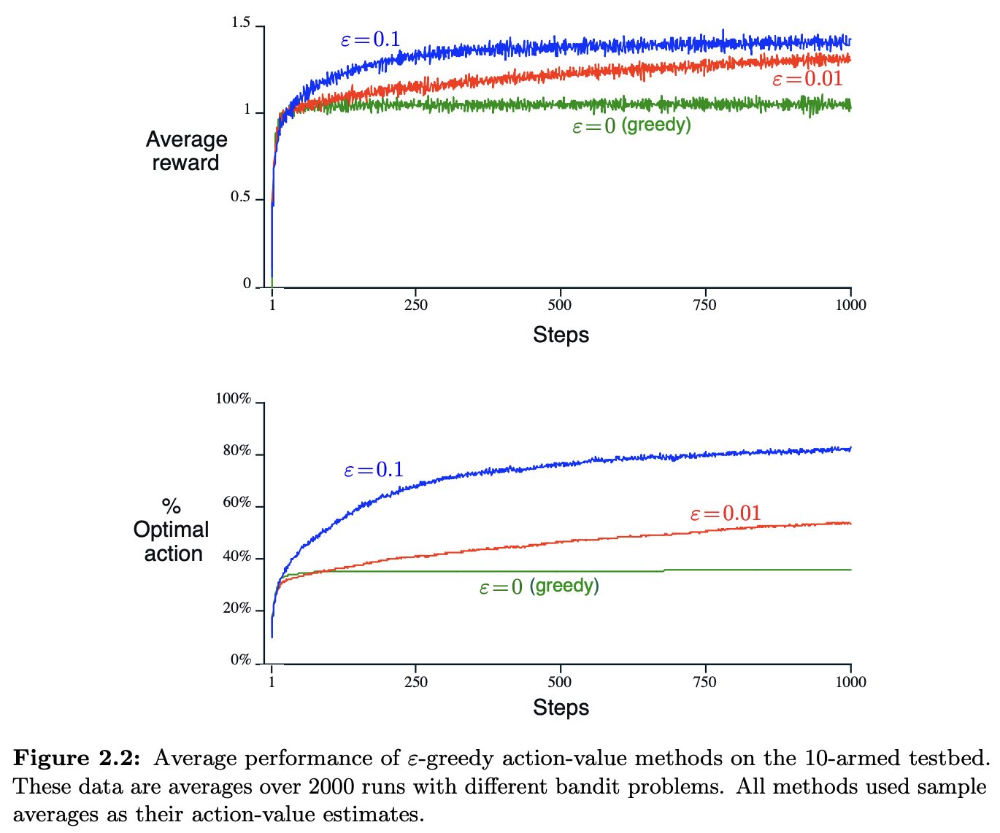
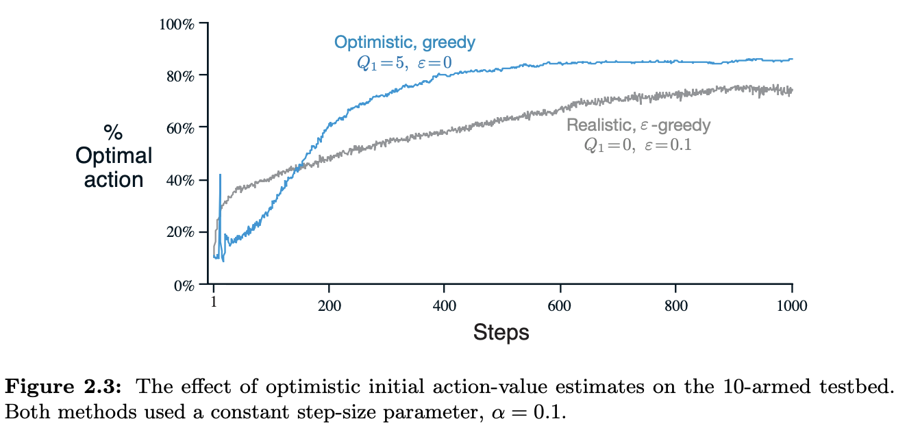
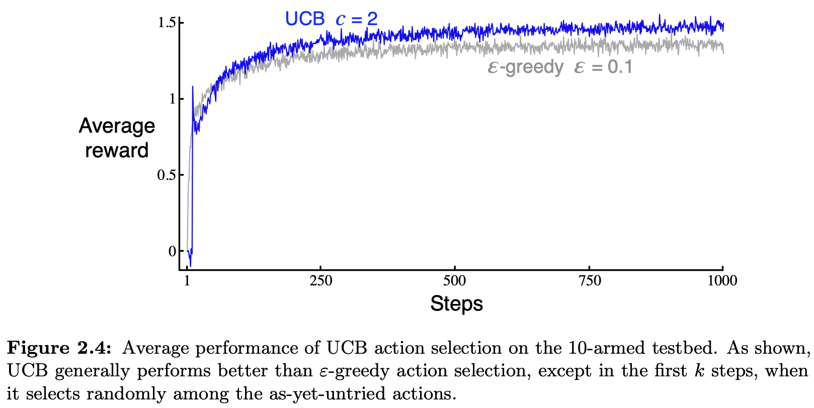

# Chapter 2 - Multi-armed Bandits

**Exercise 2.1:** In $\epsilon$-greedy action selection, for the case of two actions and $\epsilon$ = 0.5, what is
the probability that the greedy action is selected?

**Resp:** Suppose we have $n$ actions $a_1, a_2, \cdots, a_n$. Suppose without loss of generality that $a_1$ is the greedy action.

(**NOTE**: we are supposing there is a unique greedy action. When there are two or more greedy actions, ties are broken randomly, and we have different results).

So, by the $\epsilon$-greedy policy we have:

- probability $1 - \epsilon$: select greedy action $a_1$,
- probability $\epsilon$: select a random action $\Rightarrow$ each action has probability $\frac{\epsilon}{n}$ $\Rightarrow$ greedy action $a_1$ has probability $\frac{\epsilon}{n}$.

So the greedy action has probability: $1 - \epsilon + \frac{\epsilon}{n} = 1 - \epsilon\left(1 - \frac{1}{n}\right)$

With $n = 2$ actions and $\epsilon = 0.5$ we have the probability of the greedy action is $1 - 0.5\left(1 - \frac{1}{2}\right) = 0.75.$ $_\square$

**Exercise 2.2: Bandit example** Consider a k-armed bandit problem with k = 4 actions,
denoted 1, 2, 3, and 4. Consider applying to this problem a bandit algorithm using
$\epsilon$-greedy action selection, sample-average action-value estimates, and initial estimates of $Q_1(a) = 0$, for all a. Suppose the initial sequence of actions and rewards is $A_1 = 1$, $R_1 = 1$, $A_2 = 2$, $R_2 = 1$, $A_3 = 2$, $R_3 = 2$, $A_4 = 2$, $R_4 =$, $A_5 = 3$, $R_5 = 0$. On some of these time steps the $\epsilon$ case may have occurred, causing an action to be selected at
random. On which time steps did this definitely occur? On which time steps could this possibly have occurred?

**Resp:** Step 1: $Q_1(a) = 0 \ \ \ \forall a$. $A_1 = 1$ $\Rightarrow$ possibly random (greedy action is 1, 2, 3 and 4).

$R_1 = -1 \Rightarrow Q_2(1) = -1$ and $Q_2(a) = 0\ \ \ \ a \neq 1$.

Step 2: $A_2 = 2 \Rightarrow$ possibly random (greedy action is 2, 3 and 4).

$R_2 = 1 \Rightarrow Q_3(2) = 1, Q_3(1) = -1$ and $Q_3(a) = 0\ \ \ \ a = 3, 4$

Step 3: $A_3 = 2 \Rightarrow$ possibly random (greedy action is 2).

$R_3 = -2 \Rightarrow Q_4(2) = \frac{1 + (-2)}{2} = -0.5, Q_4(1) = -1$ and $Q_4(a) = 0\ \ \ \ a = 3, 4$

Step 4: $A_4 = 2 \Rightarrow$ random (greedy action is 3 and 4).

$R_4 = 2 \Rightarrow Q_5(2) = \frac{1 + (-2) + 2}{3} = \frac{1}{3}, Q_5(1) = -1$ and $Q_5(a) = 0\ \ \ \ a = 3, 4$

Step 3: $A_5 = 3 \Rightarrow$ random (greedy action is 2).

$R_5 = 0 \Rightarrow Q_6(2) = \frac{1}{3}, Q_6(1) = -1$ and $Q_6(a) = 0\ \ \ \ a = 3, 4$

**Exercise 2.3:** In the comparison shown in Figure 2.2, which method will perform best in the long run in terms of cumulative reward and probability of selecting the best action? How much better will it be? Express your answer quantitatively.

**Resp:** In long run, both $\epsilon=0.1$ and $\epsilon= 0.01$ will find the value of $q_*(a)$ because of the law of large numbers.

However, $\epsilon = 0.1 \Rightarrow 0.9 + 0.1\cdot\frac{1}{10} = 0.91 \rightarrow$ the probability to select the best action.
$\epsilon = 0.01 \Rightarrow 0.9 + 0.01\cdot\frac{1}{10} = 0.991 \rightarrow$ the probability to select the best action.

So, $\epsilon = 0.01$ will have higher probability of selecting the best action and thus will havae higher cumulative reward.

**Exercise 2.4:** If the step-size parameters, $\alpha_n$, are not constant, then the estimate $Q_n$ is a weighted average of previously received rewards with a weighting different from that given by (2.6). What is the weighting on each prior reward for the general case, analogous to (2.6), in terms of the sequence of step-size parameters?

**Resp:** We have that:
$$\begin{split}
Q_{n+1} &= Q_n + \alpha_n[R_n - Q_n] \\
        &= \alpha_nR_n + (1 - \alpha_n)Q_n \\
        &= \alpha_nR_n + (1 - \alpha_n)(Q_{n-1} + \alpha_{n-1}[R_{n-1} - Q_{n-1}]) \\
        &= \alpha_nR_n + (1 - \alpha_n)(\alpha_{n-1}R_{n-1} + (1-\alpha_{n-1})Q_{n-1}) \\
        &= \alpha_nR_n + (1-\alpha_n)\alpha_{n-1}R_{n-1} + (1-\alpha_n)(1-\alpha_{n-1})Q_{n-1} \\
        &= \alpha_nR_n + (1-\alpha_n)\alpha_{n-1}R_{n-1} + (1-\alpha_n)(1-\alpha_{n-1})\alpha_{n-2}R_{n-2} + (1-\alpha_n)(1-\alpha_{n-1})(1-\alpha_{n-2})Q_{n-2} \\
        &= \prod_{i=1}^n(1-\alpha_i)Q_1 + \sum_{i=1}^n\alpha_i\prod_{j=i+1}^n(1-\alpha_j)R_i
\end{split}$$

**Exercise 2.5 (programming):** Design and conduct an experiment to demonstrate the diculties that sample-average methods have for nonstationary problems. Use a modified version of the 10-armed testbed in which all the $q_*(a)$ start out equal and then take independent random walks (say by adding a normally distributed increment with mean 0 and standard deviation 0.01 to all the $q_*(a)$ on each step). Prepare plots like Figure 2.2 for an action-value method using sample averages, incrementally computed, and another action-value method using a constant step-size parameter, $\alpha = 0.1$. Use $\epsilon = 0.1$ and longer runs, say of $10,000$ steps.

**Resp:** Answer is in notebook [Chapter2.ipynb](Chapter2.ipynb).

**Exercise 2.6 Mysterious Spikes:** The results shown in Figure 2.3 should be quite reliable because they are averages over 2000 individual, randomly chosen 10-armed bandit tasks. Why, then, are there oscillations and spikes in the early part of the curve for the optimistic method? In other words, what might make this method perform particularly better or
worse, on average, on particular early steps?

**Resp:** As viewed previously, the optimistc initial value will be encouraged to explore in the early steps. So at some step in the early steps the optimal action will be chossen for sure, and then, will continue to explore, by choosing the other non optmial actions, that is why of the spikes.

**Exercise 2.7 Unbiased Constant-Step-Size Trick:** In most of this chapter we have used sample averages to estimate action values because sample averages do not produce the initial bias that constant step sizes do (see the analysis leading to (2.6)). However, sample averages are not a completely satisfactory solution because they may perform poorly on nonstationary problems. Is it possible to avoid the bias of constant step sizes while retaining their advantages on nonstationary problems? One way is to use a step size of

$\beta_n\ \ \dot=\ \ \frac{\alpha}{\bar o_{n-1}}$

to process the nth reward for a particular action, where $\alpha > 0$ is a conventional constant step size, and $\bar o_{n-1}$ is a trace of one that starts at 0:

$\bar o_n\ \  \dot=\ \ \bar o_{n-1} + \alpha(1 - \bar o_{n-1})$, for $n > 0$, with $\bar o_0\ \ \dot=\ \ 0$.

Carry out an analysis like that in (2.6) to show that Qn is an exponential recency-weighted average *without initial bias*.

**Resp:** From the general formula derived in exercise 2.4 we have:

$$Q_{n+1} = \prod_{i=1}^n(1-\alpha_i)Q_1 + \sum_{i=1}^n\alpha_i\prod_{j=i+1}^n(1-\alpha_j)R_i$$

We need to show that $Q_{n+1}$ is unbiased. That is, that the term $\prod_{i=1}^n(1-\alpha_i) = 0$.

In our setting, we have the step size is $\alpha_n = \beta_n = \frac{\alpha}{\bar o_n}$ and $\bar o_n\ \  \dot=\ \ \bar o_{n-1} + \alpha(1 - \bar o_{n-1})$, for $n > 0$, with $\bar o_0\ \ \dot=\ \ 0$.

So, by definition, $\bar o_1\ \  \dot=\ \ \bar o_0 + \alpha(1 - \bar o_0) = \alpha \Rightarrow \alpha_1 = \frac{\alpha}{\bar o_1} = \frac{\alpha}{\alpha} = 1$.

Thus, $\prod_{i=1}^n(1-\alpha_i) = (1-\alpha_1)\prod_{i=2}^n(1-\alpha_i) = (1 - 1)\prod_{i=2}^n(1-\alpha_i) = 0\text{ }_\square$.

**Exercise 2.8 UCB Spikes:** In Figure 2.4 the UCB algorithm shows a distinct spike
in performance on the 11th step. Why is this? Note that for your answer to be fully
satisfactory it must explain both why the reward increases on the 11th step and why it decreases on the subsequent steps. Hint: If c = 1, then the spike is less prominent

**Resp:** Using UCB algorithm, the first n steps (10 in this case) will be n different actions as $N_0(a) = 0\text{, }\forall a$ initially. After the n-th step, at step n+1, $N_1(a) = 1\text{, }\forall a$, so the agent will take the action with the highest estimate $A_t = \argmax_aQ_{10}(a)$ since the "variance" part will be the same for every action. So that is why the reward increase on the 11th step.

The decrease on the subsequent steps are due to exploration of the algorithm. Since the "variance" part is not the same for all actions, it will have chances of selecting worst actions on the subsequent steps depending on the rewards received for the optimal action. And the spike can be more or less prominent according to the value of $c$ which determines the degree of exploration.

**Exercise 2.9** Show that in the case of two actions, the soft-max distribution is the same as that given by the logistic, or sigmoid, function often used in statistics and artificial neural networks.

**Resp:** For two actions we have:

$$\begin{split}
Pr\{A_t = a_1\} &\dot= \dfrac{e^{H_t(a_1)}}{e^{H_t(a_1)} + e^{H_t(a_2)}}\text{, dividing by }e^{H_t(a_2)} \\
&= \dfrac{\frac{e^{H_t(a_1)}}{e^{H_t(a_2)}}}{\frac{e^{H_t(a_1)}}{e^{H_t(a_2)}} + 1} = \dfrac{e^{H_t(a_1)-H_t(a_2)}}{e^{H_t(a_1)-H_t(a_2)} + 1}\text{, making }e^{H_t(a_1)-H_t(a_2)} = x\\
&= \dfrac{e^x}{e^x + 1}
\end{split}$$

And this is exactly the logistic function. $_\square$.

**Exercise 2.10:** Suppose you face a 2-armed bandit task whose true action values change randomly from time step to time step. Specifically, suppose that, for any time step, the true values of actions 1 and 2 are respectively 10 and 20 with probability 0.5 (case A), and 90 and 80 with probability 0.5 (case B). If you are not able to tell which case you face at any step, what is the best expected reward you can achieve and how should you behave to achieve it? Now suppose that on each step you are told whether you are facing case A or case B (although you still don’t know the true action values). This is an associative search task. What is the best expected reward you can achieve in this task, and how should you behave to achieve it?

**Resp:** In case A (probability 0.5): $q_*(a_1) = 10$ and $q_*(a_2) = 20$.

In case B (probability 0.5): $q_*(a_1) = 90$ and $q_*(a_2) = 80$.

If we do not know which case we face.

Suppose we have probability $p$ of selecting $a_1$ and $1-p$ of selectin $a_2$, then:

$\mathbb{E}[R] = \underbrace{[p\cdot 10 + (1-p)\cdot 20]\cdot 0.5}_{\text{case A}} + \underbrace{[p\cdot 90 + (1-p)\cdot 80]\cdot 0.5}_{\text{case B}} = 50$

So for this case, the best expected reward you can achieve is 50, and whatever policy it has the expected reward will be 50.

If we know whcih case we face, then the best expected reward we can achieve is to always choose the action with highest reward in each case:

$\mathbb{E}[R] = \underbrace{20\cdot 0.5}_{\text{case A}} + \underbrace{90\cdot 0.5}_{\text{case B}} = 55$.

**Exercise 2.11 (programming):** Make a figure analogous to Figure 2.6 for the nonstationary case outlined in Exercise 2.5. Include the constant-step-size $\epsilon$-greedy algorithm with $\alpha= 0.1$. Use runs of 200,000 steps and, as a performance measure for each algorithm and parameter setting, use the average reward over the last 100,000 steps.

**Resp:** Answer is in notebook [Chapter2.ipynb](Chapter2.ipynb).
